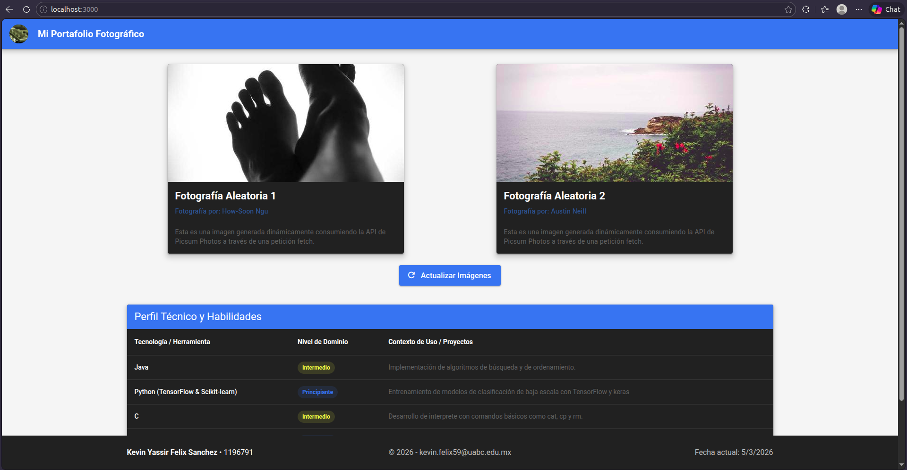
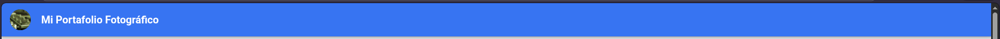
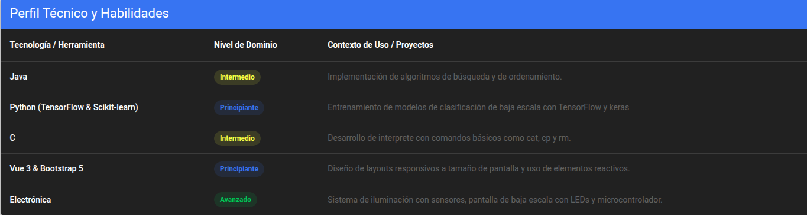

# Aplicación Web: Portafolio Fotográfico

**Estudiante:** Kevin Yassir Felix Sanchez
**Programa:** Ingeniero en Computación
**Asignatura:** Desarrollo de Aplicaciones Web

## Captura del proyecto funcionando

## Descripción del Proyecto
En esta aplicación se usa Vue 3 y Vuetify 3, la aplicación consume una API de Picsum para mostrar imágenes aleatorias, permitiendo actualizarlas dinámicamente mediante un botón.

## Tecnologías Utilizadas
* **Vue 3** (Composition API con `<script setup>`)
* **Vuetify 3** (Componentes de UI y sistema de Grid)
* **Vite** (Herramienta de construcción)
* **Fetch API** (Consumo asíncrono de servicios web)
* **Git y GitHub** (Control de versiones)

## Estructura del Proyecto
El proyecto está organizado en los siguientes componentes principales (SFC):
- `App.vue`

- `AppHeader.vue`

- `AppFooter.vue`

- `TarjetaConImagen.vue`

- `TablaDeDatos.vue`

## Funcionamiento de la API
La aplicación utiliza la función `fetch` nativa de JavaScript junto con `async/await` para comunicarse con la API de Picsum. Al presionar el botón de actualización, se hace una petición al endpoint de lista, se procesa la respuesta en formato JSON, y se seleccionan aleatoriamente dos elementos asegurando que sus IDs sean diferentes para evitar imágenes duplicadas.

## Instrucciones de Instalación y Ejecución
1. Clonar el repositorio:
   `git clone https://github.com/KevinFelix1563/DAW_Meta2.2_FelixKevin`
2. Navegar al directorio del proyecto:
   `cd proyecto-vue-vuetify`
3. Instalar las dependencias:
   `npm install`
4. Ejecutar el servidor de desarrollo:
   `npm run dev`
